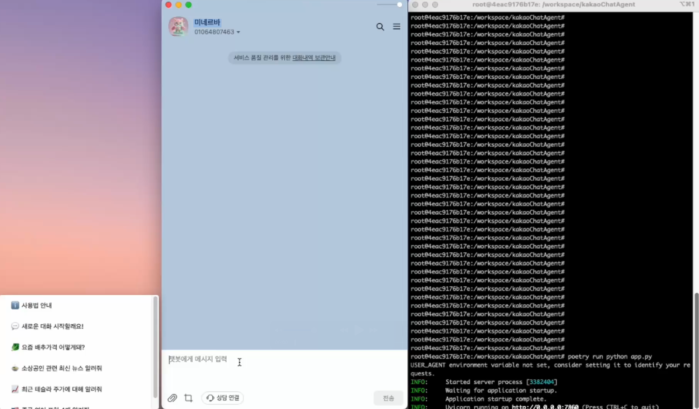

# kakaoChatAgent


## About The Project

Langgraph 기반으로 카카오톡 챗봇을 구현해보았습니다. 

- Langgraph 관련하여 먼저 공부하실분은 아래 링크 참고바랍니다.

    - [Langgraph 공식사이트](https://www.langchain.com/langgraph)

    - [Langgraph 공부기록](https://github.com/ccw7463/Langgraph)

#### 📍 기본 기능

- 싱글턴, 멀티턴 수행

- 텍스트 관련 작업 수행

#### 📍 추가 기능

- 웹 검색 기능 수행

- 사용자 개인정보, 답변 선호도 저장 및 정보기반 답변 수행

#### 📅 추가 예정 기능

- 사용자 인증

- 챗봇 페르소나 또는 답변 스타일 지정

- STT(Speech-to-Text) 후 답변

- 일일 뉴스 제공 (카카오톡 채널에서 EventAPI 사용)

#### 🔍 디버깅/최적화필요

- 웹 검색 기능 최적화

## Demo

- 유튜브 링크와 연결됩니다.

[](https://youtu.be/VluxN_yeFmA)


## Project Structure

- `configs` : 프롬프트 템플릿 저장 레포

- `data` : 사용자 정보 저장 레포 (sqlite3 사용)

- `modules` : 프로세스 및 데이터베이스 모듈

- `utils` : util 함수 모음

## Getting Started

### Installation
_파이썬 프로젝트 의존성 관리와 배포를 위해 `poetry`를 사용하였습니다._

1. 다운로드
    ```bash
    curl -sSL https://install.python-poetry.org | python3.11 -
    ```

2. 환경변수 추가

    ```bash
    export PATH="$HOME/.local/bin:$PATH"
    ```

3. 설치/버전 확인

    ```bash
    poetry --version
    ```

4. (Optional) 프로젝트별로 환경변수 폴더(.venv) 지정 

    ```bash
    poetry config virtualenvs.in-project true
    ```

5. 설치 (pyproject.toml을 기반)

    ```bash
    poetry install
    ```

6. 실행

   ```bash
   poetry run python app.py
   ```
   
